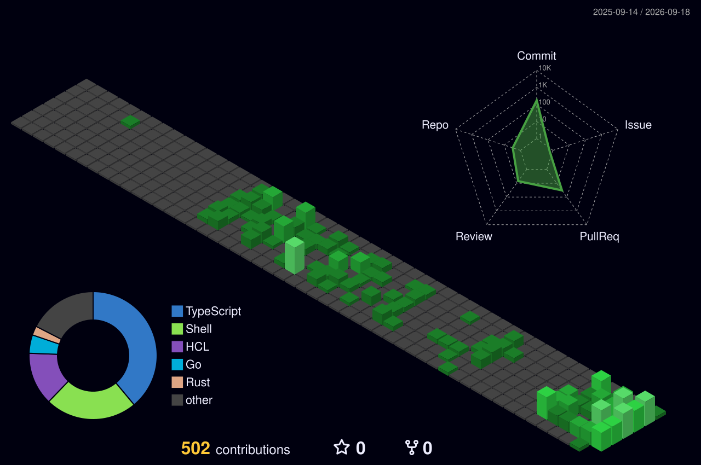

## Hey there 👋

  I'm Luiz, Just Another Engineer, Brazilian, currently based in <strong>Dublin</strong> 🇮🇪

  You will find my projects under the following GitHub organization:

<table>
  <tr>
    <td align="center" width="80">
      
    </td>
    <td>
      <a href="https://github.com/jae-labs">jae-labs</a>
       
    </td>
  </tr>
</table>
  
<h2>Fun Facts</h2></h2>

<ul>
  <li>Professional YAML indentation engineer.</li>
  <li>Patching the unpatchable.</li>
  <li>Translating business logic into Terraform errors.</li>
  <li>Replacing a generic error with a specific error.</li>
  <li>Shepherd of CrashLoopBackOff.</li>
  <li></li>
</ul>

<h2>Activity</h2> 

  <picture>
    <source media="(prefers-color-scheme: dark)" srcset="./contribution-snake-animation/dark.svg">
    <source media="(prefers-color-scheme: light)" srcset="./contribution-snake-animation/light.svg">
    
  </picture>

  <picture>
    <source media="(prefers-color-scheme: dark)" srcset="contribution-3d-animation/dark.svg"">
    <source media="(prefers-color-scheme: light)" srcset="contribution-3d-animation/light.svg"">
    
  </picture>

<h2>Like My Work? </h2> 

Show some ❤️ by 🌟 some of my repositories!

<h2>Disclaimer</h2>

This profile serves as a space for my personal initiatives and independent learning. All content, code, and opinions expressed here are strictly my own and are not affiliated with or endorsed by any past or present employer.

